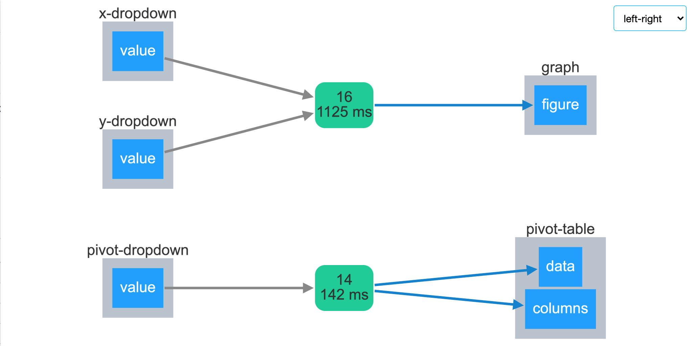

# dash-example-NBA

Live demo: https://dash-example-nba.herokuapp.com/

Ce dossier contient un exemple basique d'une application Dash. Le code
de l'application est dans le fichier `app.py`, le fichier `nba_physiques.csv`
contient les données.

Le jupyter notebook `NBA.ipynb` est un exemple de travail à réaliser en amont, 
avant de faire l'application, pour explorer les données et construire les
représentations graphiques.

Les fichiers `app_min_scatter.py` , `app_min_scatter_matrix.py` et `app_min_table.py` contiennent des versions minimales de l'application avec un seul graphique ou un seul tableau et une mise en page (`"layout"` ) minimale.

## Modules python nécessaires

Pour installer Dash consulter la page relative à l'installation :
https://dash.plotly.com/installation

Pour une installation basique, depuis une ligne de commande, faire simplement :

    pip install dash

Pour les utilisateurs avancés, je vous conseilles de créer un environnement 
dédié à l'application. Vous pouvez le créer à partir du fichier 
`environment.yml` contenu dans ce dossier, en l'important dans anaconda-navigator (onglet environment) ou depuis la ligne de commande :

    conda env create -f environment.yml

## Lancer l'application

Pour lancer l'application, depuis un terminal, exécuter la commande suivante :

    > python app.py
    Dash is running on http://127.0.0.1:8050/
    
    * Serving Flask app "app" (lazy loading)
    * Environment: production
    WARNING: This is a development server. Do not use it in a production deployment.
    Use a production WSGI server instead.
    * Debug mode: on

Dans votre navigateur, charger ensuite l'url `http://127.0.0.1:8050/` (ou celle
qui s'affichera).

## contenu de l'application

L'application complète, fichier `app.py` est divisée en deux parties :

* un graphique
* un tableau

Les deux menus déroulant au dessus du graphique contrôlent les variables portées
en abscisse et en ordonnées.

Le menu déroulant au dessus du tableau contrôle les valeurs qui sont regroupées
dans le tableau.

Ces deux actions sont réalisées grâce à deux fonctions (les `callback`). Voici
un schéma de ces `callbacks`.

La sélection des objets est réalisée grâce aux identifiants des éléments de la
page. Ils sont définis par les attributs `id` dans le code.
